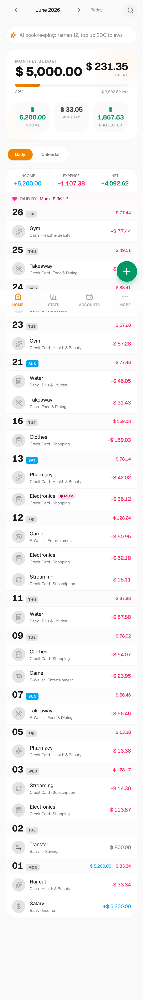
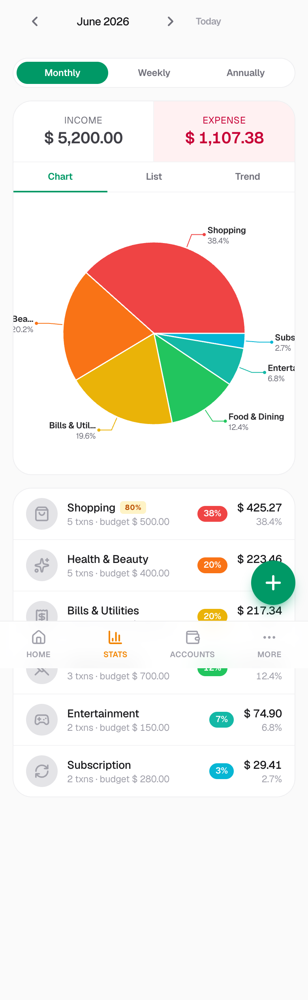
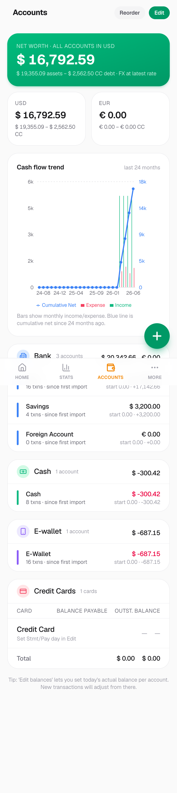
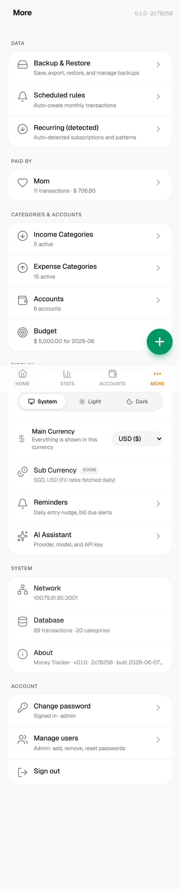

# Money Tracker

A self-hosted, single-user personal finance tracker. Log income, expenses and
transfers across multiple accounts and currencies; track credit-card statement
cycles; set monthly budgets; and review trends — all backed by a single local
SQLite file you own.

Built with **Next.js 16 (App Router) · React 19 · SQLite (better-sqlite3) ·
Drizzle ORM · Tailwind CSS · Recharts**.

> Personal project, shared as-is. It assumes one user and minimal UI auth — put
> it behind your own VPN/reverse proxy. Not a multi-tenant SaaS.

## Screenshots

> To generate these, run `npm run db:seed-demo` (sample data) then capture the
> pages below into `docs/screenshots/`. See
> [`docs/screenshots/README.md`](docs/screenshots/README.md) for exact steps.

| Dashboard | Stats & charts |
| --- | --- |
|  |  |
| **Balances** | **Settings** |
|  |  |

## Features

- Multi-account, multi-currency tracking with automatic FX conversion to a
  configurable base currency — pick it in the UI (More → Main Currency) any
  time; rates from the free [Frankfurter](https://frankfurter.dev) API.
- Credit-card aware balances using per-card statement/payment cycles.
- Monthly budgets with category/subcategory breakdowns and trend charts.
- Recurring/scheduled transactions and bill/budget reminders.
- Optional JSON API for an external client (e.g. a Telegram bot) secured by a
  bearer token.
- Optional in-app AI assistant: natural-language entry against any
  OpenAI-compatible endpoint (Ollama, OpenAI, OpenRouter, …). Provider keys live
  in your local database, never in the repo.

## Quick start

```bash
git clone https://github.com/seehow624/money-tracker.git
cd money-tracker
npm install && npm run setup && npm run dev
```

`npm run setup` does everything for you: generates `.env.local` (with a random
admin password and session secret), creates the database, your login, and a set
of example accounts + categories. It **prints the generated login** — copy it,
then open http://localhost:3000. (Re-running is safe: it never overwrites an
existing `.env.local`, and seeding is idempotent.)

Optional extras:

```bash
npm run db:seed-demo   # add a few months of sample transactions to explore
```

> Prefer to configure things by hand? Copy `.env.example` to `.env.local`, set
> `APP_USERNAME` / `APP_PASSWORD` / `APP_SESSION_SECRET`, then run `npm run
> db:migrate`, `npm run db:seed-admin`, `npm run db:seed` yourself. If you ever
> see "Invalid username or password", the admin row wasn't created — run
> `npm run db:seed-admin` (or `npm run setup`).

`npm run db:seed` inserts **example** accounts and categories. Open
`scripts/seed.ts` and replace them with your own before seeding, or just add/edit
accounts and categories in the UI afterwards. `npm run db:seed-demo` adds a few
months of fake transactions so the dashboard and charts aren't empty — re-run or
just delete those rows (they have `source = 'demo'`) once you start entering real
data.

## Configuration

All config is environment variables in `.env.local` — see
[`.env.example`](.env.example) for the full list. The essentials:

| Variable | Purpose |
| --- | --- |
| `NEXT_PUBLIC_BASE_CURRENCY` | Initial base currency for a fresh install (default `USD`). Changeable later in the UI. |
| `APP_USERNAME` / `APP_PASSWORD` | Bootstrap login for the web UI |
| `APP_SESSION_SECRET` | Signs the session cookie (use a long random string) |
| `MONEY_TRACKER_API_TOKEN` | Bearer token for `/api/*` (external clients) |
| `MONEY_TRACKER_DB_PATH` | Optional DB path override (default `./data/money.db`) |

Every account has its own currency; balances and cross-account totals are
converted into the base currency for display. Change the base currency any time
at **More → Main Currency** — it re-fetches FX rates and recomputes stored
conversions, so it's safe to switch even after you have data.

AI provider API keys are **not** environment variables — add them in the UI at
`/more/ai`; they are stored in the `ai_profiles` table inside your gitignored
`data/money.db`.

## Scripts

```bash
npm run dev / dev:lan       # dev server (lan = bind 0.0.0.0 for phone testing)
npm run build && npm start  # production
npm run typecheck           # tsc --noEmit (the only check)

npm run db:generate         # drizzle-kit generate after editing src/db/schema.ts
npm run db:migrate          # apply migrations
npm run db:seed             # seed example accounts + categories (idempotent)
npm run db:seed-demo        # sample transactions for demos/screenshots (idempotent)
npm run db:studio           # drizzle-kit studio

npm run db:run-scheduled    # post due recurring transactions   (cron: daily)
npm run db:daily-backup     # backup money.db, prune > 30 days   (cron: daily)
npm run db:fetch-fx         # refresh FX rates                   (cron: daily)
```

Wire the three scheduled jobs into cron, launchd, systemd or your process
manager of choice.

`scripts/parse-tng.mjs` is an example statement parser (Touch 'n Go eWallet PDF →
JSON) — adapt it for your own statement formats.

## Deployment

Run `npm run build && npm start` (or `start:lan` to bind `0.0.0.0`) under a
process manager and put it behind your own reverse proxy / VPN. SQLite means no
external database to provision — just back up `data/money.db` (the daily-backup
script does this for you).

## License

[MIT](LICENSE) © Jerome Teng
